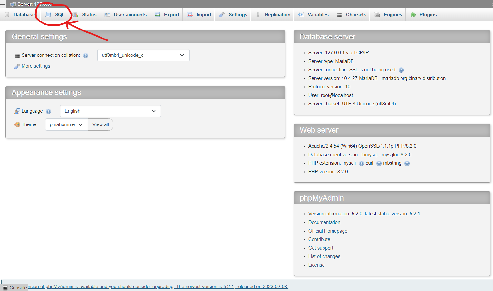

# Interactive learning website for kids in php-js
## Set up environement
for this project XAMPP was used to provide the server 
## Set up the database 
The database is called "joystick" and it has the following structure

You can create it manually in localhost/phpmyadmin/index.php or you can copy the sql code in setupdatabse.sql file and run it in the sql tab 

